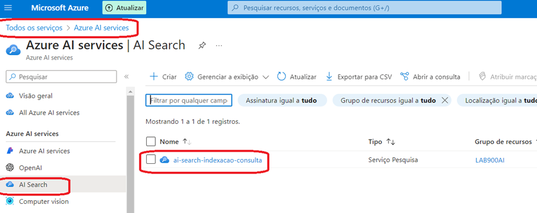
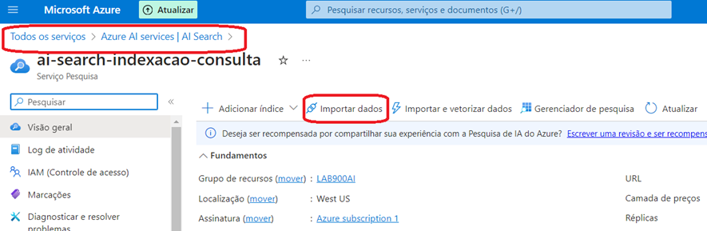
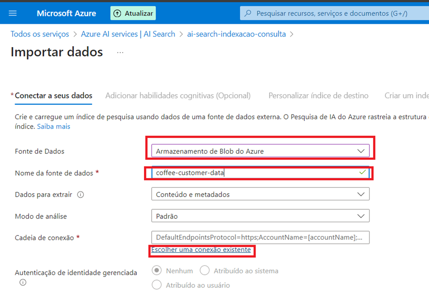
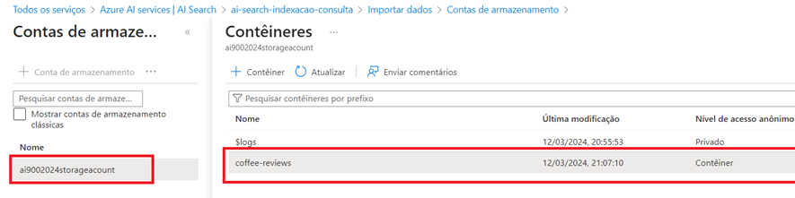
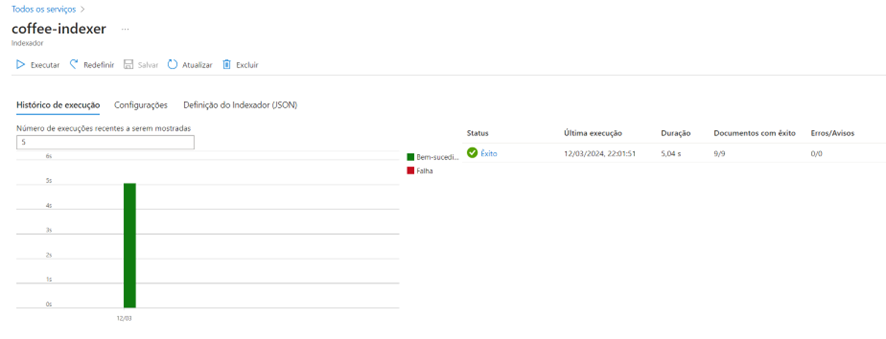

<h2>
Projeto utilizando AI Search para indexação e consulta de Dados
</h2>
  

##🚀 Seguindo o tutorial:

https://microsoftlearning.github.io/mslearn-ai-fundamentals/Instructions/Labs/11-ai-search.html,

 - 

 - 

 - 

 - 

 - 

 - 

